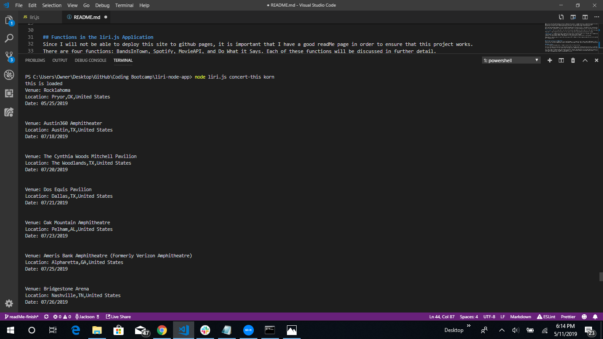

# liri-node-app

Node.JS assignment for the Coding Bootcamp at UT Austin. 

The LIRI bot is similar to the Iphone's SIRI. 
The biggest difference is that SIRI is a Speech Interpretation and Recognition Interface. 
LIRI is a Language Interpretation and Recognition Interface. 

## Creating the Application
When I first saw the specifications of how to complete this project, I thought that this is definitely going to be challenging. 
Making matters even more challenging was the fact that my instructor decided to push the due date up a week. 
He was later willing to move it back a week because the other class got another week to do the project. 

After getting some good examples in class, and getting good advice from my instructor, I decided to start tackling the project. 
Before starting, I planned out the project using a project board. This board enabled me to split the project into smaller, more manageable tasks. 

**First Issue**: The first issue that I ran into on this project was making sure that I got all of the right files downloaded into the program. 

*Resolved*: I read through the directions for this several times before downloading everything that I needed. 

**Second Issue**: I needed several APIs to make this project work. I was able to get all of the APIs that I needed except for the BandsinTown API. 
I had to email the customer support department there to get the API that I needed. 
They don't just give anyone the API. They asked me for verification and for my instructor's verification. 

*Resolved*: It took me a day to realize that there was an API for Bands in Town already provided. My instructor pointed that out to me **after** I got my own
API from BandsinTown.  

## Functions in the liri.js Application
Since I will not be able to deploy this site to github pages, it is important that I have a good readMe page in order to ensure that this project works. 
There are four functions: BandsInTown, Spotify, MovieAPI, and Do What it Says. Each of these functions will be discussed in further detail. 

### Bands in Town
To run the BandsInTown application, I typed in concert-this for the user Action. 

The first challenge, discussed earlier was getting the API for the band. After talking with my instructor, I realized that Trilogy had provided the API for me, and that I did not need to go through all of the trouble to get the application. BandsInTown was willing to give me an API after trading back and forth emails with customer service.  

Let's say I type in a popular band like *twenty one pilots*. Another challenge that I ran into was how do I account for a band name with multiple words. Originally, I had some code accounting for this at the header of the program. To fix this problem (and get the minimum viable product. (I still didn't figure out not to repeat myself)), I had to put this code in the BandsInTown, Spotify, and MovieAPI functions. 

This was not the problem for a popular band like *Korn* which only has a single word. 

This function is will tell you when and where your favorite band is performing next. 

### Spotify
To run the Spotify application, I typed in spotify-this for the user action. 

I initially had trouble setting up this function. It took a few minutes working with one of my TAs, but we managed to figure out how to properly set up the Artist Information. 
In addition, while working on this function, I learned about the usefulness of the map function. 

Like the BandsInTown application, another big challenge was accounting for songs that had multiple words. (I know that I am violating the DRY principle in this program, but these functions are working properly). To solve the problem, I had to write the code which concatenated multi-word inputs in each function. 

### MovieAPI
To run the MovieAPI application, I typed in movie-this for the user application. 

One major challenge of the MovieAPI was accounting for all of the ratings. Not every movie entered had a rotten tomatoes rating. My instructor and I were discussing about whether all of the ratings were displayed in an array. To solve this, I console logged response and consloe logged response.data to look at how to find out the parameters. I haven't completely solved this problem, but I have come up with a "quick-fix" approach which would avoid giving me a major error. 

Another problem with the Movie API is that it doesn't seem to output exactly what I inputted. For example, when I input Little for the input parameter, 

I get the Little Mermaid as my result. I am not sure if that is due to the API, or if that is due to a mistake in the code. I have been testing this function, and have gotten the movie name to output correctly. 

### Do What it Says
To run the Do What is Says application, I typed in do-what-it-says for the user application. 

The Do What it Says application is reading from the random.txt file. This function was the easiest of the four functions to implement. 

The default response from the random.txt file is:
user action: spotify-this-song
input parameter: I want it that way 

I am going to try a couple of other responses from the random.txt file.
For the movie API: 
user action: movie-this
input parameter: 300

For the Bands in Town API: 
user action: concert-this
input parameter: twenty one pilots

What I may need to do with this function is have it run everything in the file. This will be necessary with a for loop. 